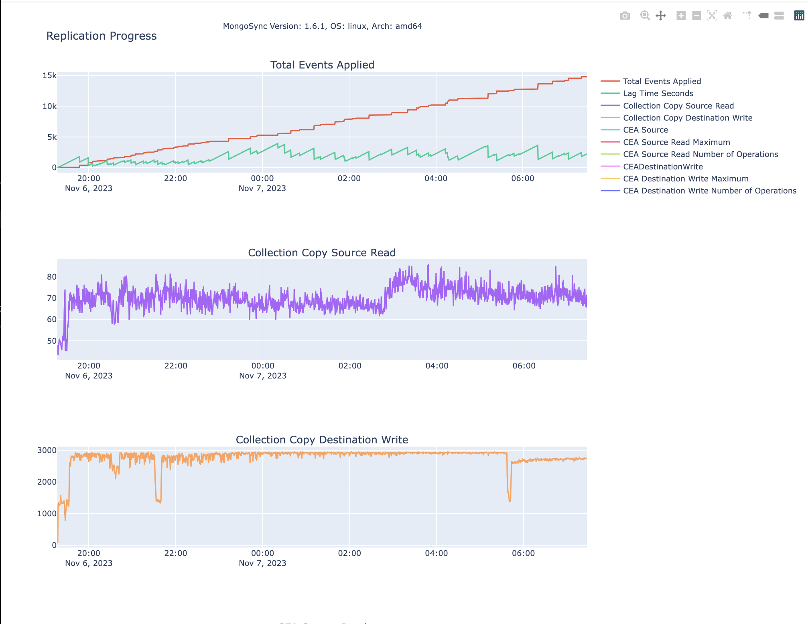
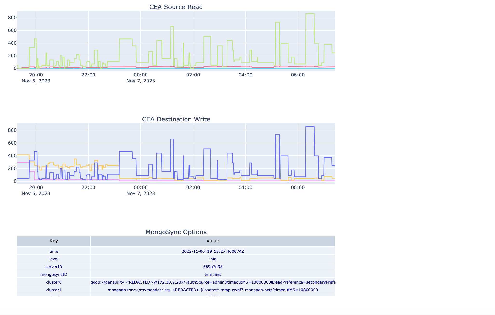

# mongosync_metrics_python

This project contains a Python script, `mixed_json_arcadia_plotly_multiple_edit_text.py`, that processes the `mongosync` JSON data and generates various plots using Plotly. The script also includes a Dockerfile for containerizing the application and a `requirements.txt` file listing the Python dependencies.




## mixed_json_arcadia_plotly_multiple_edit_text.py

This Python script processes JSON data and generates various plots using Plotly. The plots include scatter plots and tables, and they visualize different aspects of the data, such as `CEA Destination Write`, `Collection Copy Source Read`, and `Collection Copy Destination Write`.

The script uses the Plotly library for creating the plots and the pandas library for data manipulation. It also uses the datetime library for handling time data.

## Dockerfile

The Dockerfile is used to create a Docker image of the application. The Docker image includes the Python environment with all the necessary dependencies installed, as well as the Python script itself.

To build the Docker image, navigate to the directory containing the Dockerfile and run the following command:

```bash
docker build -t my-python-app .
```

To run the Docker container, use the following command:

```bash
docker run -it --rm --name my-running-app my-python-app
```

## requirements.txt

The `requirements.txt` file lists the Python packages that the script depends on. The packages are specified with their version numbers to ensure compatibility.          

To install the dependencies, use the following command:

```bash
pip install -r requirements.txt
```

This command should be run in the Python environment where you want to run the script. If you're using a virtual environment, make sure to activate it first.

## Getting Started

1. Clone the repository to your local machine.
2. Navigate to the directory containing the Python script and the `requirements.txt` file.
3. Install the dependencies with `pip install -r requirements.txt`.
4. Run the Python script with `python mixed_json_arcadia_plotly_multiple_edit_text.py`.

Please note that you need to have Python and pip installed on your machine to run the script and install the dependencies. If you want to use Docker, you also need to have Docker installed.