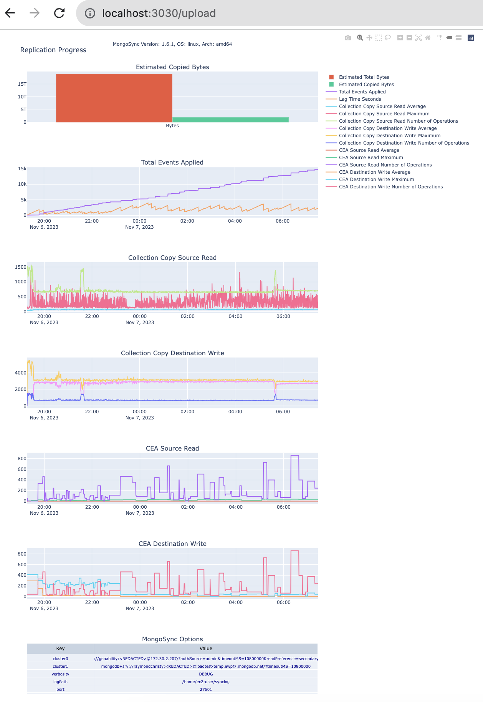
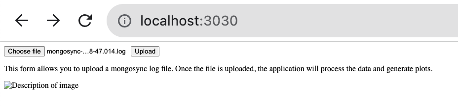

# mongosync_metrics_python

This project contains a Python script, `mmongosync_plotly_multiple.py`, that processes the `mongosync` JSON data and generates various plots using Plotly on port **3030**. The script also includes a Dockerfile for containerizing the application and a `requirements.txt` file listing the Python dependencies.



## mongosync_plotly_multiple.py

This Python script processes JSON data and generates various plots using Plotly. The plots include scatter plots and tables, and they visualize different aspects of the data, such as `CEA Destination Write`, `Collection Copy Source Read`, and `Collection Copy Destination Write`.

The script uses the Plotly library for creating the plots and the pandas library for data manipulation. It also uses the datetime library for handling time data.

## Dockerfile

The Dockerfile is used to create a Docker image of the application. The Docker image includes the Python environment with all the necessary dependencies installed, as well as the Python script itself.

To build the Docker image, navigate to the directory containing the Dockerfile and run the following command:

```bash
docker build -t my-python-app .
```

To run the Docker container, use the following command:

```bash
docker run -it --rm --name my-running-app my-python-app
```

## requirements.txt

The `requirements.txt` file lists the Python packages that the script depends on. The packages are specified with their version numbers to ensure compatibility.          

To install the dependencies, use the following command:

```bash
pip install -r requirements.txt
```

This command should be run in the Python environment where you want to run the script. If you're using a virtual environment, make sure to activate it first.

## Getting Started

1. Clone the repository to your local machine.
2. Navigate to the directory containing the Python script and the `requirements.txt` file.
3. Install the dependencies with `pip install -r requirements.txt`.
4. Run the Python script with `mongosync_plotly_multiple.py`.

Please note that you need to have Python and pip installed on your machine to run the script and install the dependencies. If you want to use Docker, you also need to have Docker installed.

## Accessing the Application and Viewing Plots

Once the application is running, you can access it by opening a web browser and navigating to `http://localhost:3030`. This assumes that the application is running on the same machine where you're opening the browser, and that it's configured to listen on port 3030.



## Uploading the mongosync Log File

The method for uploading the `mongosync` log file depends on how the application is designed. The application provides a user interface for uploading files, you can use that. Typically, this involves clicking a "Browse" or "Upload" button, selecting the file from your file system, and then clicking an "Open" or "Upload" button.

## Viewing the Plot Information

Once the `mongosync` log file is uploaded, the application processes the data and generates the plots. You can view these plots by navigating to the appropriate page in the application. The exact method depends on how the application is designed, but typically, you would click on a link or button, or navigate to a specific URL.

If the plots aren't immediately visible after uploading the file, you may need to refresh the page. If the plots still aren't visible, check for any error messages or notifications from the application.

## ToDo

- Test with multiple mongosync versions, only tested with 1.6.1.
- Certified the time lines.
- Create more metrics with "TRACE" debug level